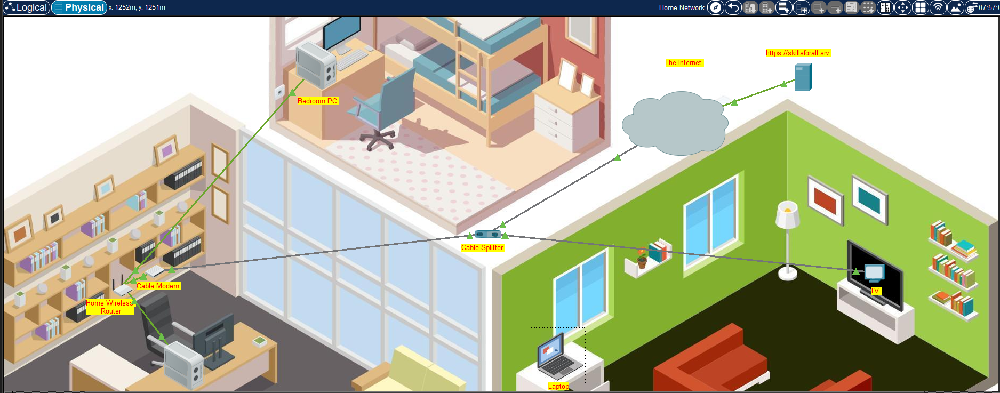
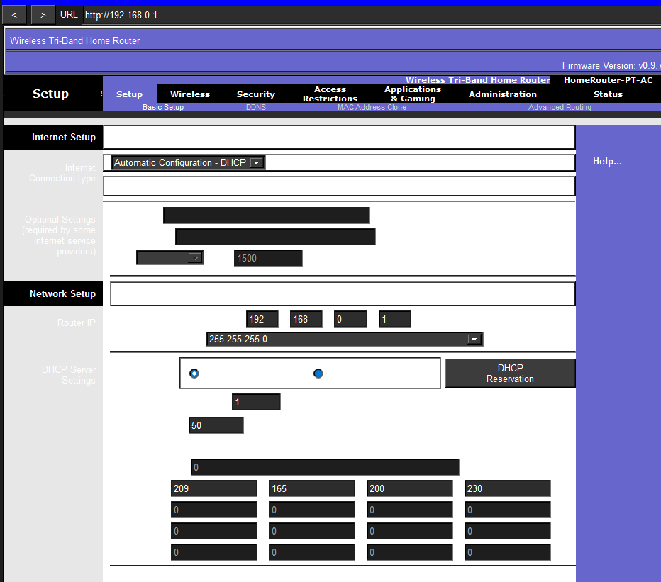
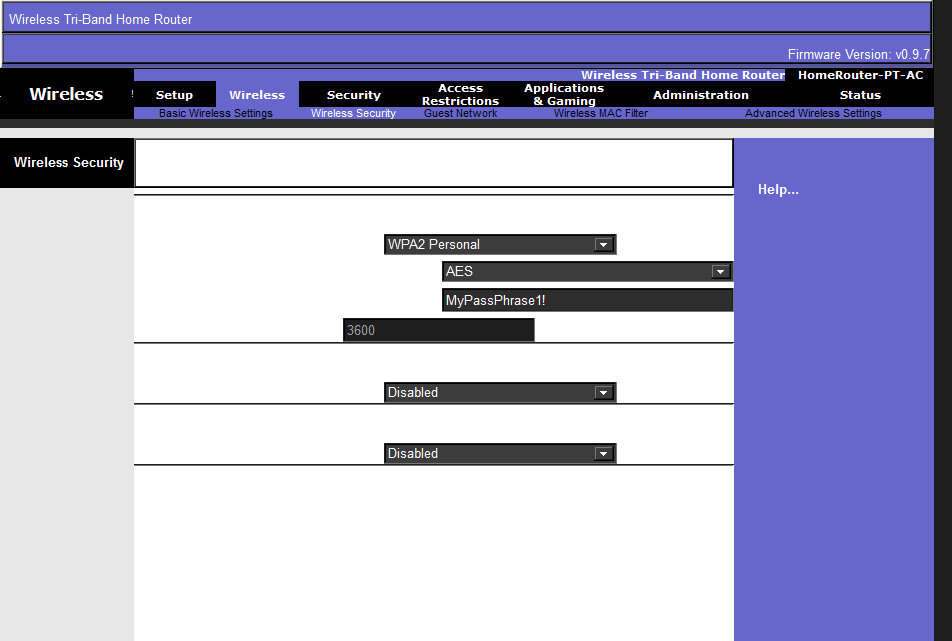
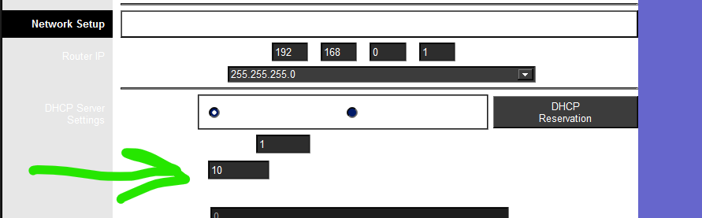
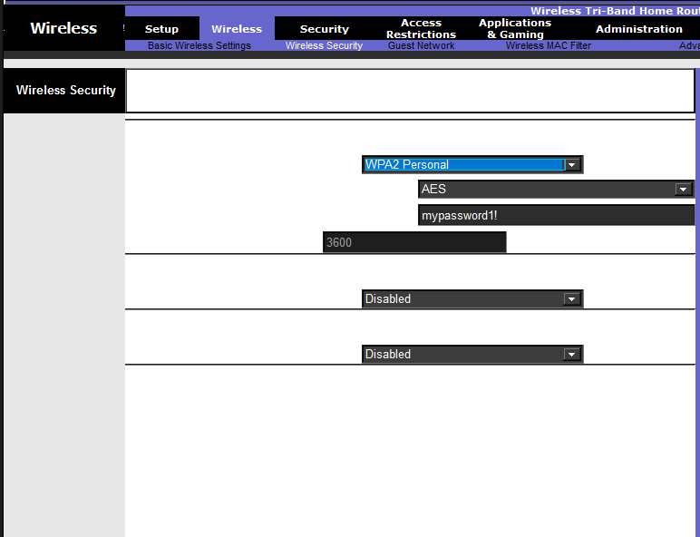

# Home Network Design & Wireless Security Implementation
## Project Overview
Platform: Cisco Packet Tracer

Status: Completed & Verified

The goal of this project was to design and deploy a functional home network for a residential client (Natsumi). The implementation involved establishing physical layer connectivity via a Cable Provider, configuring a SOHO wireless router via GUI, and hardening the network against unauthorized access.

## Technical Implementation
### 1. Physical Layer & Media Connectivity
Signal Splitting: Implemented a Cable Splitter to separate Video (Television) and Data (Cable Modem) services using Coaxial cabling.

Internet Gateway: Established the WAN link by connecting the Cable Modem to the Wireless Router's Internet Port using Copper Straight-Through cabling.

Wired LAN: Deployed Ethernet connections for stationary hosts (Office and Bedroom PCs) to the router’s GigabitEthernet switch ports.

### 2. Router Configuration & Hardening (GUI)
Accessed via the Office PC web browser at the default gateway (192.168.0.1), the following security and networking configurations were applied:

Administrative Security: Mitigated unauthorized access by changing default credentials (admin/admin) to a complex password (MyPassword1!).

DHCP Scoping: Configured the internal DHCP server to a 10-user maximum pool. This minimizes the attack surface by preventing excessive unauthorized IP assignments in a high-density environment

Wireless LAN (WLAN) Security:

SSID: MyHome (2.4 GHz).

Encryption: Implemented WPA2-Personal (AES), the strongest protocol available on the hardware.

Authentication: Set a robust Pre-Shared Key (PSK) to ensure only authorized devices can associate with the Access Point.

### 3. Connectivity Verification
I verified the network using the following CLI and Browser tests:

Wired Client Verification:

Bash

C:> ipconfig /all
# Confirmed IPv4 Address in 192.168.0.x range
# Confirmed Default Gateway: 192.168.0.1
Wireless Association:

Successfully associated the Living Room Laptop with the MyHome SSID.

Verified HTTP connectivity by successfully loading skillsforall.srv in the web browser.

## Key Skills Demonstrated
SOHO Router Administration: GUI-based configuration and password hardening.

Wireless Security: Understanding of SSID broadcasting and WPA2 encryption.

Troubleshooting: Using ipconfig, ping, and web requests to verify the OSI model layers.
